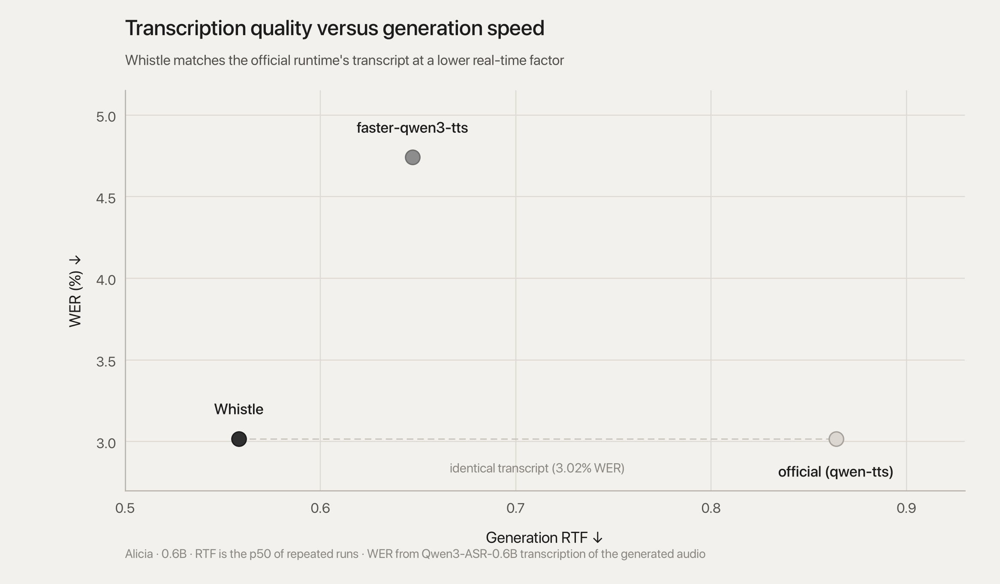

# whistle

faster inference for **Qwen3-TTS CustomVoice** (0.6B / 1.7B) on a single consumer GPU (tested on RTX 3050).

whistle achieves **1.5x** improvement over the official `qwen-tts` runtime by CUDA graph replay on the **Talker module's post-attention FFN** (20 graphs for 0.6B) and the **residual codebook predictor positions** (15 graphs, one per residual codebook position), which are the specific areas of **fixed shape** execution. Attention is left eager for the talker, while the code predictor module uses **PrefixStaticLayer**—a kvcache implementation which exposes only the active attention prefix slice for each step while maintaining a fixed backing buffer. These **35 graphs are replayed once per frame**, using native PyTorch with zero custom kernels, quantisation, or re-training.



## metrics summary

alicia.txt letter, 0.6B, bf16, greedy, RTX 3050 (6 GB), p50 of 5 runs, WER from Qwen3-ASR-0.6B.

| runtime | wall | RTF ↓ | × real-time ↑ | WER ↓ | % gain ↑ |
|---|---:|---:|---:|---:|---:|
| official `qwen-tts` | 83.26 s | 0.856 | 1.17× | 3.02% | — |
| **whistle** | **54.27 s** | **0.558** | **1.79×** | **3.02%** | **34.8%** |

both runtimes transcribe identically: 7 word edits over 232 reference words.

tables and charts for other GPUs, model sizes and streaming are in [`latency_report.md`](latency_report.md). benchmark tools are in `tools/`.

**[full technical article](https://kelechi.cc/articles/whistle-qwen3-tts)**

## requirements

- an nvidia GPU: CUDA only, there is no CPU inference path. 0.6B peaks at ~3 GB VRAM, 1.7B at ~5 GB.
- bf16 is hardcoded, so Ampere or newer runs it natively (developed on an RTX 3050 Laptop, 6 GB).
- Python 3.12+ and PyTorch 2.4+ (`uv sync` installs both).
- disk: ~2.4 GB (0.6B weights) or ~4.3 GB (1.7B weights), downloaded from Hugging Face on first run.

## install

```bash
git clone https://github.com/kelechi-c/whistle.git
cd whistle && uv sync
```

## usage

Synthesize one clip (this downloads weights on first run):

```bash
uv run whistle "your life is your canvas, what will you paint?" --out hello.wav
```

Streaming, 12-frame chunks with a ramp so the first audio arrives early:

```python
from qwen_tts import Qwen3TTSModel
from whistle.streaming import stream_tts

model = Qwen3TTSModel.from_pretrained(
    "Qwen/Qwen3-TTS-12Hz-0.6B-CustomVoice",
    device_map="cuda:0", dtype="bfloat16", attn_implementation="sdpa",
)
for chunk in stream_tts(model, "hello from whistle streaming.", chunk_size=12):
    # chunk["audio"] is (1, 1, samples); squeeze() it if writing with soundfile
    player.write(chunk["audio"].float().cpu(), chunk["sample_rate"])
    if chunk["final"]:
        break
```

First CPU-ready audio on the RTX 3050 is **116 ms** for a short sentence and **154 ms** for the letter in alicia.txt (chunk ramp 2/4/8, then 12-frame chunks, 25-frame codec context).

HTTP streaming server (`audio/wav`, chunked):

```bash
uv sync --extra server
uv run python -m whistle.server --port 8000
```

## testing

Run CPU structural tests (runs in <1s, no checkpoint or GPU required):

```bash
uv run python -m unittest discover -s tests -v
```

Lint with ruff:

```bash
uv run ruff check src tests
```

Run the GPU release gate (structural tests, natural EOS parity, streaming, and sampled capture):

```bash
bash tools/run_promo_check.sh
```

## what whistle does not do

- **no custom kernels:** runs entirely on PyTorch CUDA graphs and standard PyTorch operators.
- **no quantization:** weights remain full bfloat16.
- **no CPU inference fallback:** requires an NVIDIA CUDA device with bfloat16 support.
- **greedy parity vs sampling:** exact bit-identical parity against official `qwen-tts` is validated on greedy decoding at natural EOS. Sampling (`--temperature` / `--top-k`) is supported via captured sampling graphs, but exact numerical equivalence against official sampling schedules is not guaranteed.

## acknowledgements

- [Qwen3-TTS](https://github.com/QwenLM/Qwen3-TTS) by Alibaba Cloud Qwen team for the original model architecture, weights, and tokenizer.
- [faster-qwen3-tts](https://github.com/andimarafioti/faster-qwen3-tts) by Andi Marafioti for benchmarking exploration and inspiration.

## license

Apache 2.0. See [LICENSE](LICENSE) for details.
