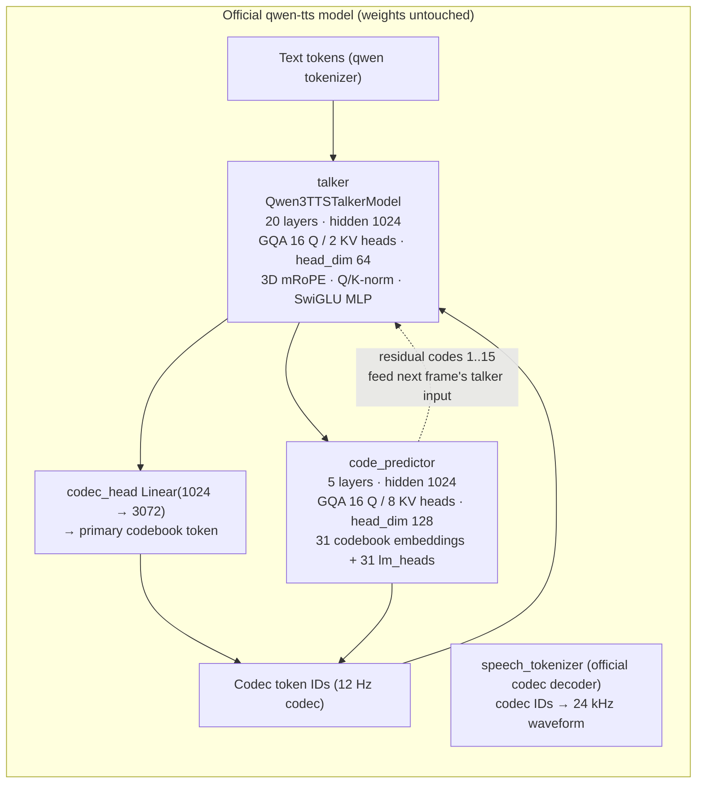
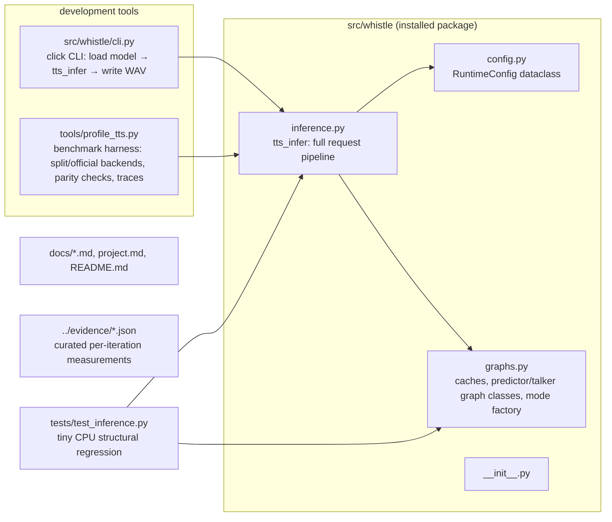
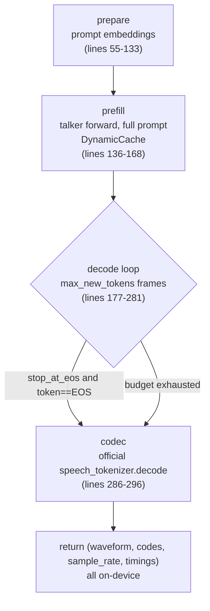
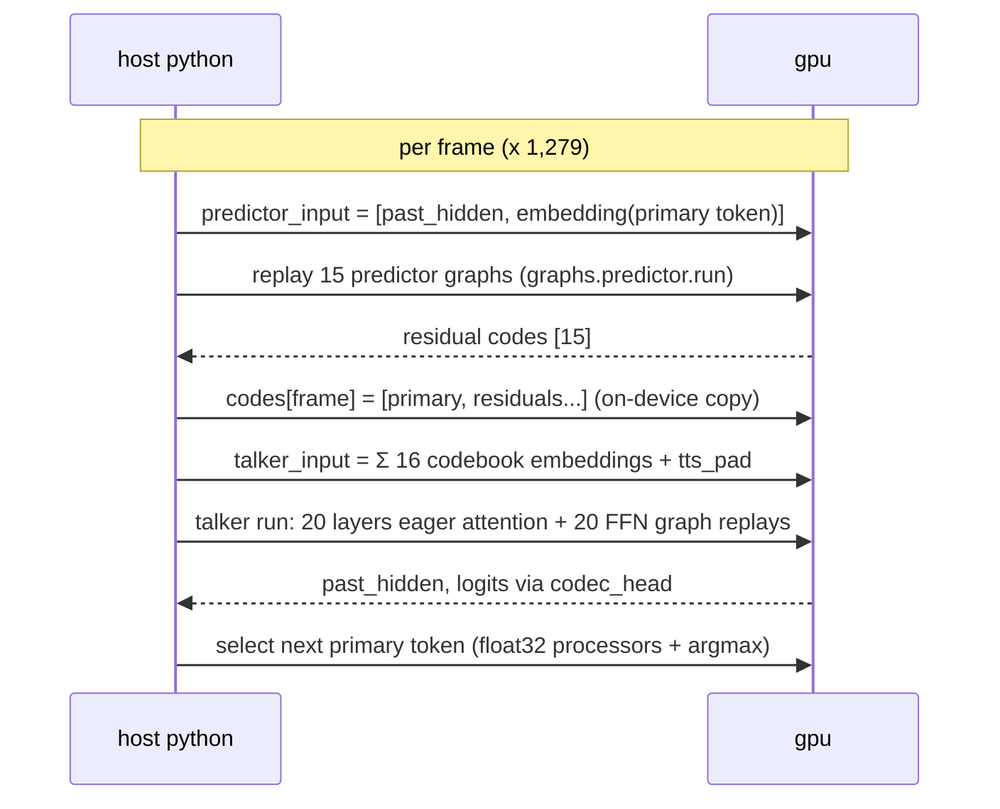
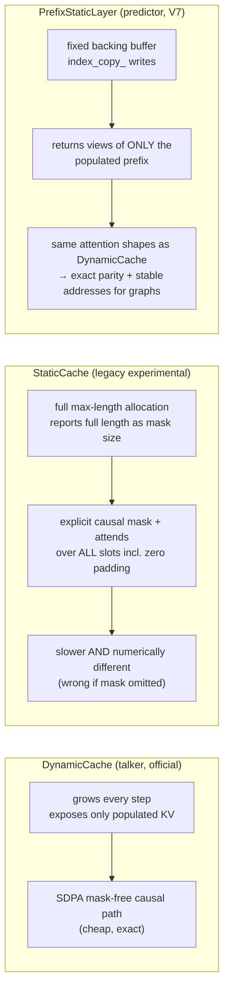
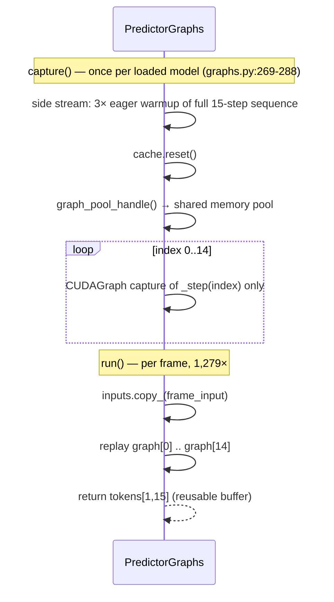
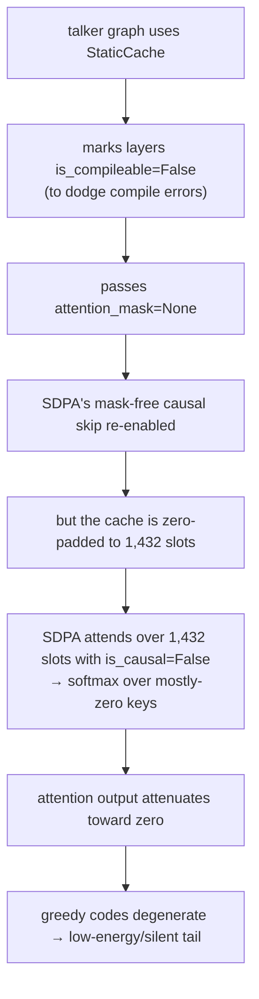
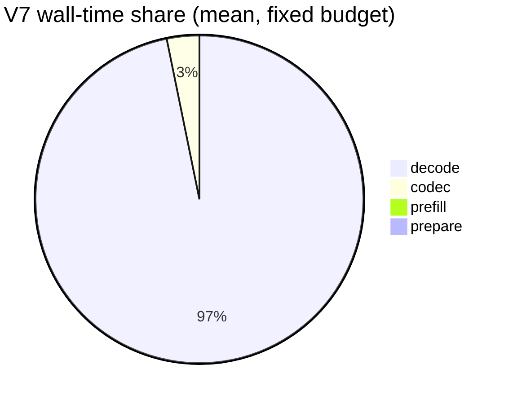
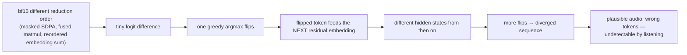

# Whistle — Technical Deep Dive

> Codebase shape, benchmark contract, and every inference optimization made on
> Qwen3-TTS, explained in depth for the technical article.
>
> Generated from a full audit of the repository at `92dfcec` (main). All
> latency numbers are historical measurements taken on the RTX 3050 GPU box
> (PyTorch 2.13.0, CUDA 13.0, bfloat16, SDPA); no inference was run while
> writing this document. Line numbers refer to the current working tree.

---

## 1. TL;DR

Whistle reduces **batch-one Qwen3-TTS 12Hz 0.6B CustomVoice** inference latency
on a 6 GB RTX 3050 Laptop GPU from **91.722 s → 56.858 s** (RTF 0.896 → 0.556,
1.800× real-time), a **38.01% reduction**, without changing the model weights,
the greedy token policy, the codec IDs, or the decoded waveform.

The winning insight: the official runtime is **launch-bound, not
compute-bound**. Each 80 ms audio frame spawns one talker step plus a nested
15-token residual-predictor loop through Hugging Face `GenerationMixin` — about
**20,000+ small Python-dispatched CUDA launches per utterance**. The final
design (V7) removes the nested scheduling and wraps the two fixed-shape hot
regions in **eager-kernel CUDA graphs**: 15 graphs for the predictor's
residual-codebook positions and 20 graphs for the talker layers' residual FFN
blocks. Everything with a variable shape (prompt prefill, talker attention with
its growing KV cache) deliberately stays eager.

The other headline lesson: **a fast number is not a correct number**.
Autoregressive decoding amplifies one flipped bf16 `argmax` into a diverged
sequence, and one shortcut (attending over a zero-padded static KV cache)
produced silent audio. Two faster measurements (V5 at 48.1 s, V6 at 56.6 s)
were invalidated by the exact codec-ID + waveform parity gate. V7 is the
fastest configuration that passes it.

---

## 2. Scope and identity

| Question | Answer |
|---|---|
| What is optimized | Batch-one `Qwen/Qwen3-TTS-12Hz-0.6B-CustomVoice` TTS inference |
| What is preserved | Official `qwen-tts` weights and modules, official codec decoder, greedy `argmax` policy, exact codec IDs, exact waveform |
| What is changed | Scheduling, KV-cache storage layout, CUDA graph capture boundaries, host synchronization |
| Hardware for benchmarks | RTX 3050 Laptop GPU, 6 GB VRAM, bf16, PyTorch SDPA |
| Primary language | Python (the runtime is an execution engine around the official model, not new kernels) |
| Not in this repo anymore | Qwen3-ASR code was removed in cleanup; the Triton kernel lab lives in a separate project (`decode-lab`) |

The repository is **TTS-only** now. Anything mentioning ASR (including the
README first line and `qwen3tts.md`'s 25 Hz/32-codebook variant) is historical
or describes a different model variant.

---

## 3. The model: what one forward pass does

### 3.1 Architecture



Two nested autoregressive transformers:

- **Talker** (≈0.6B): predicts **one primary codec token per frame** and
  produces the hidden state that conditions the residual predictor. Its KV
  cache grows by one position per frame, so its attention shapes are
  variable-length.
- **Residual code predictor**: a small 5-layer transformer that, per frame,
  runs a **15-step autoregressive sequence** predicting residual codebooks
  1–15 (Multi-Token-Prediction style: step `i` consumes the embedding of
  codebook `i−1`, and each step uses its own `lm_head[i]`).
- **Codec decoder**: official neural codec (12 Hz tokenizer) that turns
  `[frames × 16]` codec IDs into 24 kHz audio. It already does chunked decode
  with left context; Whistle calls it as-is, once, at the end.

### 3.2 Frame arithmetic

| Quantity | Value |
|---|---:|
| Codec frame rate | 12.5 Hz → **80 ms per frame** (the model family is marketed as "12Hz") |
| Codebooks per frame | 16 = 1 primary (talker) + 15 residuals (predictor) |
| Predictor forwards per frame | 15 (1 two-token seed + 14 single-token residual steps) |
| Layer forwards per frame | 20 (talker) + 5 × 15 (predictor) = **95** |
| Layer forwards per benchmark run | 1,279 frames × 95 ≈ **121,500** |
| Audio per benchmark run | 1,279 × 0.08 = 102.320 s |

### 3.3 Why the official runtime is slow

The official `Qwen3TTSModel.generate` nests three layers of generality:

```text
GenerationMixin.generate (talker)
 └─ for each of ~1,279 outer tokens:
     └─ talker.forward
         └─ code_predictor.generate (nested GenerationMixin)
             ├─ 1 prefill forward (2-token seed)
             └─ 14 single-token decode forwards
     └─ embed & sum 16 codebook vectors → next talker input
```

Every one of those forwards crosses Python, Hugging Face scheduling, logits
processing, mask construction, and cache management. The work per kernel is
tiny — **batch-one bf16 GEMV dominates**. Kernel profiling measured:

- two GEMV kernel families ≈ **55.6% of CUDA time**;
- ordinary matmul ≈ 9.7%;
- **SDPA only a few percent**.

So the target is **launch overhead and host scheduling**, not attention or
FLOPs. This is why the final win came from graph capture, not from custom
kernels.

Modular profiling of the official baseline (128-frame diagnostic) confirms
where the time goes:

| Component | Share of decode |
|---|---:|
| Residual predictor | ~71.9% |
| Talker | ~26.6% |
| Scheduling/token work | ~1.5% |

---

## 4. Current codebase shape

### 4.1 File map



| Path | Lines | Role |
|---|---:|---|
| `src/whistle/inference.py` | 316 | `tts_infer` — the entire request path: prompt, prefill, decode loop, codec. Scheduling lives here. |
| `src/whistle/graphs.py` | 648 | All cache/graph machinery: `PrefixStaticLayer`, `PredictorGraphs`, `DecoderFfnGraph`, `OfficialTalker`, `PredictorGraph`, `TalkerGraph`, `DecodeGraphs`, `decode_graphs`. |
| `src/whistle/config.py` | 42 | `RuntimeConfig` dataclass (checkpoint, device, dtype, seed, frame budget). |
| `src/whistle/cli.py` | 64 | Click CLI: model load + `tts_infer` + WAV write. Installed as `whistle`. |
| `tools/profile_tts.py` | 439 | Benchmark/parity harness: `--backend split|official`, `--talker-mode`, `--fixed-tokens`, `--check-codec-parity`, `--trace-out`. |
| `tests/test_inference.py` | 149 | One CPU structural test with a tiny official-shaped model. |
| `docs/failures_and_trials.md` | — | Curated optimization history and failure analysis. |
| `docs/results.md` | — | Full benchmark method, commands, and per-run tables. |
| `docs/qwen3_tts_official_vs_faster.md` | 350 | Official vs `faster-qwen3-tts` architecture comparison (upstream snapshot study). |
| `project.md` | 142 | Working notes / birds-eye map. |
| `evidence/*.json` | — | Curated machine-readable measurements cited by the retained reports. |

Local-only (gitignored, not pushed): `local/` (drafts, raw runs, traces, and
archived experiments), `refs/`, `stash/`, `sandbox/`, `.venv/`, generated
`docs/*.html`, and machine state such as `.pi/` and `handoff/`.

### 4.2 The two entry points

- **Interactive generation**: `PYTHONPATH=src uv run python -m whistle.cli "text"
  --speaker ryan --out whistle.wav` → loads the official checkpoint, runs
  `tts_infer` (default mode = `predictor-ffn-graphs`), transfers the waveform to
  CPU once, and writes WAV.
- **Benchmarking**: `uv run python tools/profile_tts.py --backend split|official
  --text-file testdata/alicia.txt ...` → warmups, timed iterations, optional parity
  check, optional profiler trace, and JSON output under `local/`.

The package exposes the `whistle` console script from `src/whistle/cli.py`.

---

## 5. The runtime pipeline, phase by phase

`tts_infer` (`src/whistle/inference.py:39`) executes five non-overlapping
phases. Everything stays on-device until the caller explicitly transfers the
waveform.



Phase timings use **CUDA events** (no per-step syncs): events are recorded at
phase boundaries and one `synchronize()` runs after the codec enqueue
(`inference.py:299-308`). On CPU the same phases use `perf_counter`.

### 5.1 prepare — prompt construction (lines 55–133)

Replicates the official `non_streaming_mode=True` CustomVoice prompt
**tensor-natively** (this is why it's duplicated here instead of calling the
official builder — the official path materializes lists/CPU tensors and routes
through `GenerationMixin`):

```text
talker_input = concat over time (
  role             = text_projection(text_embedding(input_ids[:, :3]))      # "<|im_start|>assistant\n"
  codec_header     = tts_pad ⊗ len(prefix−2) + tts_bos + codec_prompt[:-1]  # think tokens + speaker embed + pad/bos
  spoken_text      = text_projection(text_embedding(input_ids[:, 3:-5])) + tts_eos
                       + codec_padding (codec_pad embedding, same length)
  final            = tts_pad + codec_bos
)  → shape [1, prefill_len, 1024]
```

Speaker identity comes from a preset speaker ID embedded through
`codec_embedding`; language selects the think/nothink codec prefix. Capacity is
checked up-front with the formula `prefill_length + max_new_tokens − 1 ≤ 2048`
(`inference.py:145`).

### 5.2 prefill (lines 136–168)

One eager `talker()` forward over the full prompt with `use_cache=True`,
filling the **growing `DynamicCache`** (in graph modes) or a static cache (in
legacy experimental modes). Prefill is deliberately **never captured in a
graph** — its length varies per request. Outputs: first logits (for the first
primary token) and `past_hidden` (the talker's last hidden state, which seeds
the predictor). mRoPE deltas produced during prefill are copied into the talker
state for later positions (`set_rope_deltas`, `graphs.py:389`).

### 5.3 decode — the frame loop (lines 177–281)

Per frame (12.5 Hz, 80 ms of audio):



Only **2 graph-replay boundaries per frame** replace what used to be ~16 nested
forward calls plus their sampling and cache bookkeeping. Token selection is
greedy with official semantics (`_select_token`, `inference.py:23`):

- logits cast to **float32** (official processors run in f32),
- `RepetitionPenaltyLogitsProcessor(1.2)` + `SuppressTokensLogitsProcessor`
  (suppresses `vocab_size − 1024` … `vocab_size` **except EOS 2150**),
- `argmax`.

EOS 2150 stays reachable only if the logits are not truncated to the
2,048-token codec vocabulary — an earlier bug truncated it away.

In `official-eager` mode the loop instead calls the official outer
`talker()` one token at a time (which internally runs the official predictor)
— that branch is the correctness reference (`inference.py:215-252`).

### 5.4 codec (lines 286–296)

The collected `[frames, 16]` codec tensor is trimmed to the natural EOS length
and passed to the **official** `speech_tokenizer.model.decode(...)`. No vocoder
reimplementation, no CPU round-trip: the decoded waveform stays on-device.

---

## 6. The optimization toolkit (`src/whistle/graphs.py`)

`graphs.py` is the entire optimization surface. Mode selection happens once per
loaded talker through a cached factory.

### 6.1 Mode matrix

`TalkerMode` (`graphs.py:10`):

| Mode | Predictor path | Talker path | Status |
|---|---|---|---|
| `official-eager` | `OfficialPredictor` — official `predictor.generate` per frame | `OfficialTalker` — official outer forward, growing `DynamicCache` | Correctness reference |
| `predictor-ffn-graphs` | `PredictorGraphs` — 15 per-position eager CUDA graphs | `OfficialTalker` + every layer wrapped in `DecoderFfnGraph` (FFN-only graphs) | **Default, promoted V7, exact parity** |
| `compile` | `PredictorGraph` — whole 15-step loop `torch.compile(reduce-overhead)`, full `StaticCache` + prebuilt masks | `TalkerGraph` compiled, `StaticCache` + explicit masks | Experimental (V6-style, invalid) |
| `cuda-graph` | same as `compile` | `TalkerGraph` manual CUDA graph around the compiled step | Experimental (V5/V5.1-style) |

`DecodeGraphs.__init__` (`graphs.py:580-634`) picks the classes; the
`decode_graphs` factory (`graphs.py:637`) is `functools.cache`d on
`(talker, max_cache_len, talker_mode)`, so graph objects, buffers, and the CUDA
memory pool are **built once per loaded model and reused across requests**.

⚠️ Lifecycle hazard: for `predictor-ffn-graphs` on CUDA, `DecodeGraphs`
**permanently replaces each `talker.model.layers[i]` with a `DecoderFfnGraph`
wrapper** (`graphs.py:602-614`). Switching modes on the same loaded model is
not reversible and not covered by tests — reload the model when changing
modes.

### 6.2 KV-cache semantics — the linchpin of correctness

Three cache shapes appear in the codebase; the differences matter enormously:



- **`DynamicCache`** concatenates K/V every step → new storage addresses every
  step → **cannot be captured in a CUDA graph** (graph replay needs stable
  addresses). But it exposes only populated entries, letting SDPA take its
  mask-free single-token path.
- **`StaticCache`** preallocates the full capacity. It's graph-friendly but
  eager SDPA then attends over the whole allocation (1,432 zero-padded slots in
  the historical experiments) — measured **~28% slower** talker in the A/B.
  And if you *also* suppress the explicit mask (the V5 shortcut), SDPA's
  causal skip runs `is_causal=False` over zero padding → attention attenuates
  toward zero → **silent audio**.
- **`PrefixStaticLayer`** (`graphs.py:23-79`) is the reconciliation used by
  V7's predictor: a fixed backing buffer written with `index_copy_` that
  **returns prefix views** so attention sees exactly the same shapes as
  `DynamicCache` (`get_mask_sizes` reports `cumulative_length`; `reset()` only
  zeroes the logical length). Stable addresses for graphs, dynamic-cache
  semantics for numerics.

### 6.3 `PredictorGraphs` — 15 per-position eager CUDA graphs (V7 core)



Why **15 separate graphs** instead of one whole-loop graph: each residual
position has a different active-prefix length (position 0 attends over 2
tokens, position 1 over 3, … position 14 over 16), so no single graph shape
covers the loop. Capturing the *whole* loop at full capacity (16 slots with
padding) reproduces the `StaticCache` numerics that broke parity. One graph
per position preserves each position's exact eager attention shape.

Each `_step(index)` (`graphs.py:236-252`) is the **original eager kernel
sequence** — `small_to_mtp_projection → model forward (with prefix cache) →
lm_head[index] → argmax → copy_ into the token buffer` — so the graph removes
only the launch/scheduling overhead, never the numerical path. On CPU the same
sequence runs eagerly (`run()`, `graphs.py:285-288`) — this is what the tiny
CPU test exercises.

### 6.4 `DecoderFfnGraph` — the talker's shape-invariant half (V7 core)

Talker attention is variable-length (KV grows per frame) and stays eager. The
post-attention half of every layer is fixed-shape `[1,1,1024]`:

```text
captured region (one graph per layer):
    output = inputs + mlp(post_attention_layernorm(inputs))
```

`forward()` (`graphs.py:316-347`):
- sequence length ≠ 1 or no graph → plain eager `self.layer(...)` (prefill path);
- sequence length = 1 → run `input_layernorm` + `self_attn` **eagerly**, copy
  `residual + attention` into the stable input buffer, `graph.replay()` the FFN
  half.

Earlier experiments showed the boundary matters: a **MLP-only** graph (without
the residual add and norm) was *slower* than eager because input-copy +
replay overhead exceeded the savings; including norm + MLP + residual made it
worthwhile (2.8% at 128 frames).

### 6.5 The legacy/experimental classes

- **`OfficialPredictor`** (`graphs.py:192-210`): calls official
  `code_predictor.generate(do_sample=False)` per frame. Reference behavior.
- **`OfficialTalker`** (`graphs.py:350-401`): one official one-token forward
  with a growing `DynamicCache`, per-position attention mask, and mRoPE
  position IDs derived from the prefill deltas. Its `run()` is what V7 uses —
  the graph wrapper around its layers is the only optimization.
- **`PredictorGraph`** (`graphs.py:404-470`): the V3/V5/V6 lineage — full
  `StaticCache`, prebuilt per-position causal masks, and
  `torch.compile(predictor_loop, mode="reduce-overhead")` owning a cudagraph
  tree. Kept as a selectable mode but numerically divergent.
- **`TalkerGraph`** (`graphs.py:473-577`): fixed `StaticCache` + prebuilt mask
  table; step callable is eager / `torch.compile` / manual CUDA graph. Legacy
  (V4–V6 lineage).

### 6.6 On-device discipline

Every output buffer (`codes`, `primary_history`, `predictor_input`, graph I/O)
is preallocated once and written with `copy_`. The only `.item()` in the hot
loop is the EOS check (`inference.py:213`) — present only when `stop_at_eos`
is enabled; the fixed-token benchmark path has zero host synchronizations
between frames.

---

## 7. Benchmark contract and measurement methodology

### 7.1 The fixed-budget contract

| Setting | Value |
|---|---|
| Model | `Qwen/Qwen3-TTS-12Hz-0.6B-CustomVoice` |
| Input | complete `testdata/alicia.txt` (a letter, ~1.5 KB) |
| Speaker / language | Ryan / English (historical benchmark) |
| dtype / attention | bfloat16 / PyTorch SDPA |
| GPU | RTX 3050 Laptop GPU 6 GB |
| Budget | **1,280 selected talker tokens = 1,279 complete codec frames = 102.320 s audio** |
| Selection | greedy `argmax`, repetition penalty 1.2 |
| Timing policy | warmups excluded, then 3 measured runs, report p50 |

The budget mismatch is historical and important: the official generator counts
*selected* talker tokens (1,280), while the explicit loop counts *completed*
frames (1,279). Both produce the same 1,279 frames — aligning them in the
parity harness cost the team a one-frame comparison bug.

**Fixed-token vs natural-EOS are separate protocols.** The benchmark ignores
EOS so every version does identical work; natural-EOS runs are correctness and
listening tests (the repaired path stops at 1,216 frames / 97.28 s).

### 7.2 Commands

Official baseline:

```bash
uv run --no-sync python tools/profile_tts.py --text-file testdata/alicia.txt --backend official \
  --model Qwen/Qwen3-TTS-12Hz-0.6B-CustomVoice --speaker Ryan --lang English \
  --max-new-tokens 1280 --fixed-tokens --warmup 1 --iterations 3 \
  --json-out local/benchmarks/official_tts_0.6b_alicia.json
```

V7 (promoted split path):

```bash
uv run python tools/profile_tts.py --text-file testdata/alicia.txt --backend split \
  --talker-mode predictor-ffn-graphs --speaker Ryan --lang English \
  --max-new-tokens 1279 --fixed-tokens --repetition-penalty 1.2 \
  --warmup 1 --iterations 3 --json-out local/benchmarks/v7_exact_graphs_0.6b_alicia.json
```

### 7.3 Measurement rules learned the hard way

- Phase timings are **CUDA events** (async) with **one terminal
  synchronization** — host timers measure queueing, not execution.
- Profiler traces and per-token events belong in **separate diagnostic runs**;
  they distort the measured hot loop.
- Compilation, graph capture, and lazy cache allocation are absorbed by
  **excluded warmups** — but verify how many: V5.1 needed **three** full
  warmups because one left a late setup pass in the first measured run.
- p50 over repeated runs with **phase breakdowns retained** — a single headline
  can hide a module regression (V3 hid a +31% talker regression behind a
  −40% predictor win).
- Keep input, speaker, language, dtype, attention backend, and budget fixed
  across versions.

---

## 8. Every optimization, in depth

### 8.1 Progression at a glance

| Version | Change | p50 (s) | RTF | × real-time | Validity |
|---|---:|---:|---:|---:|---|
| Official | nested HF generation | 91.722 | 0.896 | 1.116× | reference |
| V1 | explicit prefill/decode scheduler | 71.382 | 0.698 | 1.433× | valid |
| V2 | on-device buffers, sync removal | 67.974 | 0.664 | 1.505× | valid |
| V3 | static cache + `torch.compile` predictor | 57.477 | 0.562 | 1.780× | valid |
| A/B | V3 + dynamic talker cache | 50.011 | 0.489 | 2.046× | valid, not promoted as headline |
| V4 | manual CUDA graphs (predictor loop + talker) | 64.431 | 0.630 | 1.588× | valid, regression |
| V5 | compiled predictor loop + talker graph | 48.106 | 0.470 | 2.127× | **invalid — silent output** |
| V5.1 | + explicit causal mask | 64.188 | 0.627 | 1.594× | valid, slow |
| V6 | + compiled talker | 56.577 | 0.553 | 1.808× | **invalid — parity fails @ frame 1, cb 13** |
| **V7** | **per-position predictor graphs + talker FFN graphs** | **56.858** | **0.556** | **1.800×** | **valid, exact parity, promoted** |

ASCII view (wall seconds, `*` = valid headline, `!` = invalidated):

```text
official  91.7  ██████████████████████████████████████████████
V1        71.4  ███████████████████████████████████████
V2        68.0  ██████████████████████████████████████
V3        57.5  ████████████████████████████████
A/B       50.0  ██████████████████████████████
V4        64.4  ████████████████████████████████████
V5        48.1  ██████████████████████████████  ! silent audio
V5.1      64.2  ████████████████████████████████████
V6        56.6  ███████████████████████████████  ! parity fail
V7*       56.9  ███████████████████████████████  ← promoted
```

### 8.2 Baseline: official nested generation (91.722 s)

Official `qwen-tts` CustomVoice path, fixed 1,280 tokens. Phase breakdown
(non-overlapping, from `../evidence/official_tts_0.6b_alicia.json`):

| Phase | Mean (s) | Share |
|---|---:|---:|
| Code predictor | 65.791 | 71.72% |
| Talker excluding predictor | 24.054 | 26.22% |
| Speech codec | 1.838 | 2.00% |
| Wrapper overhead | 0.047 | 0.05% |

Takeaway: **the predictor is the bottleneck** — 15 nested token steps per
frame through the full Transformers generation stack, ~19,000 tiny forwards
per run.

### 8.3 V1 — explicit prefill/decode scheduling (71.382 s, −22.2%)

**Change:** replace nested `GenerationMixin` scheduling with a hand-written
loop that calls the official modules directly: explicit prefill, one talker
token forward per frame, and the 15 predictor steps unrolled — same forwards,
same operation order.

**Mechanism:** removes the per-token Python/Transformers scheduling tax
(mask construction, cache-position bookkeeping, generate() argument plumbing,
logits-processor list handling) while the CUDA work is identical.

**Evidence:** at 128 frames, official outer eager = 7.838 s vs direct
scheduler = 7.007 s (**−10.6% with exact codec + waveform parity**).

### 8.4 V2 — kill the host/GPU ping-pong (67.974 s, −4.8%)

**Change:** keep every intermediate on-device and preallocate:

- codec-ID output tensor, residual buffers, cache positions, position IDs;
- predictor embedding weights stacked once into one tensor (batched embedding
  lookup);
- no Python list accumulation of frames/residuals;
- no per-frame `.item()` EOS sync in the fixed-budget path;
- codec decode writes chunks directly into one GPU waveform (bypasses the
  wrapper's CPU conversion);
- CUDA events replace intermediate `torch.cuda.synchronize()` calls.

**Mechanism:** removes host stalls and allocation churn. Every
device→host→device or allocation in the inner loop costs far more than the
kernel it schedules.

### 8.5 V3 — static cache + compiled predictor (57.477 s, −15.4%)

**Change:** preallocated `StaticCache` for predictor and talker;
`torch.compile(mode="reduce-overhead")` on the predictor pass; embedding
weights stacked; allocation hoisted out of Dynamo.

**Mechanism:** `reduce-overhead` lets Inductor fuse the predictor's small
GEMVs and build its own cudagraph tree; the static cache gives it fixed
addresses. Combined predictor time fell **49.404 s → 29.413 s (−40.46%)**;
residual passes dropped to **1.531 ms each**.

**But** talker time rose **19.901 s → 26.106 s (+31.18%)**. The static talker
cache forces eager SDPA to attend over the full zero-padded allocation with an
explicit mask instead of its cheap mask-free populated-prefix path.

### 8.6 The A/B that redirected the project (50.011 s)

Controlled experiment: V3 with *only* the talker cache switched back to
`DynamicCache`:

| Metric | Static talker | Dynamic talker | Δ |
|---|---:|---:|---:|
| p50 wall | 57.426 s | 50.011 s | −12.91% |
| Talker step | 26.106 s | 18.685 s | −28.43% |
| Combined predictor | 29.413 s | 29.430 s | +0.06% (noise) |

**Lesson:** static KV storage is only faster when the execution path exploits
fixed shapes (graphs/compilation). For eager SDPA, dynamic prefix semantics
win. This A/B is why V7 keeps talker attention on a `DynamicCache` and only
uses stable storage where graphs need it (the predictor's prefix-visible
cache).

### 8.7 V4 — manual CUDA graphs done naively (64.431 s, regression)

**Change:** capture the **complete eager predictor loop** as one CUDA graph
and the talker pass as a second graph, with persistent buffers and precomputed
masks.

**Result:** extremely deterministic (64.430–64.432 s across runs) but
**12.1% slower than V3**. The modular profile explains it: the predictor
graph replays **unfused eager kernels** (36.240 s vs 29.413 s compiled) —
graph capture removed launch overhead but threw away Inductor's fusion; the
talker graph inherited the slow full-capacity static-cache attention
(26.180 s).

**Lesson:** a CUDA graph is not a speedup by itself. It preserves whatever
kernels it captured. Never wrap an already-compiled region in a second manual
graph expecting a second win — and capture the *fast* variant.

### 8.8 V5 — the fastest number in the repo is wrong (48.106 s, invalid)

**Change:** compiled full predictor loop (`reduce-overhead`, Inductor owns the
cudagraph tree) + captured talker graph.

**Result:** 48.106 s — 2.13× real-time, the fastest ever measured. **But the
audio is silent after ~2 s.**

**Root-cause chain (the full story):**



`attention_mask=None` is *correct* for a dynamic cache (only populated KV
exists) and *catastrophic* for a zero-padded static one. The 48.1 s headline
benchmarks broken output. The compiled-predictor half was correct and was
retained.

### 8.9 V5.1 — the correct version of V5 is slow (64.188 s)

**Change:** restore an explicit per-position causal mask for the static talker
graph.

**Result:** correct output, but the talker graph time exploded **15.452 s →
28.459 s (+84.2%)**, and the run needed **three** excluded warmups before a
late setup pass stopped contaminating the first measurement. The explicit-mask
full-capacity SDPA path is simply more work than the dynamic mask-free path.
Conclusion: a graphed static-cache talker is a dead end at batch-one on this
GPU — keep talker attention dynamic and eager.

### 8.10 V6 — compiled talker crosses the numerical line (56.577 s, invalid)

**Change:** `torch.compile(reduce-overhead)` on the explicit-mask static
talker step (predictor loop stays compiled).

**Result:** 56.577 s — nearly as fast as V7. **But exact codec parity fails at
frame 1, codebook 13** (`split=344` vs `official=1484`), after 1,181 of 20,448
IDs matched. Frame 0 and frame-1 codebooks 0–12 match, localizing the first
flip to the predictor sequence conditioned on the first **compiled** talker
hidden state.

**Mechanism:** bf16 arithmetic is reduction-order sensitive. The compiled
static-cache talker produces a *slightly* different hidden state; one greedy
`argmax` flips; autoregression amplifies the flip across the rest of the
sequence (see §9.1). Mathematically equivalent ≠ numerically identical, and
for greedy AR decoding only identical counts.

### 8.11 V7 — exact eager graphs at the right boundaries (56.858 s, promoted)

**Design constraints derived from all failures:**

1. **No numerical change anywhere.** Every captured body is the *original
   eager kernel sequence* — no fusion, no compiled variants, no full-capacity
   attention, official bf16 embedding-sum order, float32 logits processing.
2. **Graph only what is shape-invariant.** Variable prompt → eager prefill.
   Growing talker KV → eager attention on `DynamicCache`. Fixed predictor
   positions (2…16 tokens) → 15 graphs. Fixed `[1,1,1024]` talker FFN →
   20 graphs.
3. **Stable storage without changed semantics.** Predictor uses
   `PrefixStaticLayer` — fixed addresses, dynamic-prefix attention views.
4. **One graph pool, one capture pass, cached per model.** Shared
   `graph_pool_handle()`, 3 eager warmups per boundary on a side stream, then
   capture outside the measured iterations.

**Result** (fixed budget, 1,279 frames / 102.32 s audio):

| Run | Wall (s) | RTF | × real-time |
|---:|---:|---:|---:|
| 1 | 56.829 | 0.555 | 1.800× |
| 2 | 56.858 | 0.556 | 1.800× |
| 3 | 56.881 | 0.556 | 1.799× |
| **p50** | **56.858** | **0.556** | **1.800×** |

Phase shares:



128-frame modular diagnostic of V7 decode: predictor 65.94%, talker 32.75%,
scheduling/token work 1.30%.

**Validation:** a reference was generated **before** the graph wrappers were
installed, then the complete sequence was compared afterwards: **20,480/20,480
codec IDs and 2,457,600/2,457,600 waveform samples matched exactly** (the
independent validation run used 1,280 complete frames = 102.400 s; the
historical benchmark itself is the 1,279-frame run, and its JSON records
`codec_parity_checked: false`). Peak allocated VRAM ≈ 3.22 GB.

**Per-frame economics:** the predictor went from 15 nested generation calls to
15 graph replays; the talker from a full outer forward to 20 eager attention
halves + 20 FFN replays. Only 2 Python-side graph boundaries per frame remain.

### 8.12 Rejected experiments (and why)

| Experiment | Outcome | Why rejected |
|---|---|---|
| Prefix-visible preallocated KV cache alone | 7.004 s vs 7.007 s | allocation wasn't a bottleneck (but became V7's graph storage) |
| One graph per predictor position (eager) | 7.007 → 5.682 s @128 frames | ✅ kept — the basis of V7 |
| Talker MLP-only graphs | slower | boundary too small; input-copy + replay overhead exceeds savings |
| Talker residual-FFN graphs | 5.525 s @128 frames | ✅ kept (−2.8%) |
| Gate/up projection fusion | −0.4%, prefix only | marginal; no independent full parity run |
| QKV projection fusion | mismatch @ frame 6, cb 1 | larger GEMV picks a different reduction path |
| Static/compiled talker+predictor combos | mismatch @ frame 3/5/1 | see divergence table below |
| V4.1 (compiled loop + dynamic eager talker) | 91.148 s p50, unstable | noncompetitive diagnostic; rolled back |

Divergence table (first differing codec ID):

| Talker | Predictor | First mismatch |
|---|---|---|
| Static eager | Static eager | frame 3, codebook 15 |
| Compiled static | Static eager | frame 5, codebook 15 |
| Static eager | Compiled static | frame 1, codebook 13 |
| Official eager + DynamicCache | Official greedy predictor | exact (reference) |

---

## 9. Correctness engineering

### 9.1 Why tiny numerical differences explode



The parity gate (from the archived experiment journal, in escalation order):

1. codec tensor shape;
2. location of the first differing codec ID;
3. exact equality of every codec ID;
4. waveform shape + exact sample equality;
5. independent full-sequence validation — reference generated **before**
   installing any candidate wrapper.

Plausible audio was explicitly declared insufficient evidence.

### 9.2 Bug inventory that the gate caught

- primary logits sliced to `0:2048` → talker **EOS 2150 unreachable** → fixed
  by full-vocab + official suppression list;
- repetition penalty + suppression applied to **bf16** logits instead of
  float32 (official order is f32) → changed decisions;
- bf16 residual-embedding sum in a different order;
- parity harness compared **misaligned frame sets** (1,279 explicit vs 1,278
  official complete frames — the corrected harness requests one more official
  selected token);
- decoder consumed the **full preallocated token buffer** instead of stopping
  at EOS (false trailing audio);
- `token.item()` EOS check synchronizes every frame — acceptable for
  natural-stop runs, removed from fixed-budget benchmarks;
- V5's `attention_mask=None` on a zero-padded static cache (the silent tail,
  §8.8).

### 9.3 Greedy-policy collapse (a *separate* failure mode)

Repetition penalties 1.05 and 1.1 drove the greedy model into a low-energy
repetitive state after ~16 s on `testdata/alicia.txt` — the audio sounded truncated
but still contained samples. This was a **generation-policy collapse, not a
waveform bug**. Penalty 1.2 keeps energy healthy and reaches natural EOS.

Repaired natural-EOS reference (official-eager mode, rp=1.2):

| Check | Result |
|---|---:|
| Frames / audio | 1,216 / 97.280 s |
| Codec IDs | 19,456 / 19,456 exact |
| Waveform samples | 2,334,720 / 2,334,720 exact |
| Diagnostic wall (one cold run) | 76.049 s |
| RMS 0–8 / 8–16 / 16–32 / 32–64 / 64–97 s | 0.0296 / 0.0322 / 0.0279 / 0.0248 / 0.0230 |

---

## 10. Numbers appendix

### 10.1 Decode-stage breakdowns across versions (modular runs, s)

| Stage | V1 | V3 | A/B | V4 | V5 | V5.1 | V6 |
|---|---:|---:|---:|---:|---:|---:|---:|
| Predictor seed (1,279×) | 3.627 | 2.004 | 2.019 | — | — | — | — |
| Predictor residuals (1,279×14) | 45.777 | 27.409 | 27.411 | — | — | — | — |
| Predictor loop (whole) | — | — | — | 36.240 | 30.647 | 33.516 | 30.721 |
| Talker | 19.901 | 26.106 | 18.685 | 26.180 | 15.452 | 28.459 | 23.887 |
| Other overhead | 0.058 | 0.012 | 0.012 | 0.113 | 0.112 | 0.122 | 0.112 |
| Total decode | 69.363 | 55.518 | 48.127 | 62.533 | 46.211 | 62.090 | 54.720 |

### 10.2 Per-run phase means (fixed-budget headline runs, s)

| Phase | Official | V1 | V2 | V3 | V4 | V5 | V5.1 | V7 |
|---|---:|---:|---:|---:|---:|---:|---:|---:|
| prepare | — | 0.002 | 0.002 | 0.022 | 0.004 | 0.004 | 0.006 | 0.002 |
| prefill | — | 0.050 | 0.050 | 0.080 | 0.076 | 0.076 | 0.086 | 0.051 |
| decode | — | 69.450 | 66.052 | 55.548 | 62.528 | 46.203 | 62.064 | 54.981 |
| codec | 1.838 | 1.835 | 1.831 | 1.843 | 1.822 | 1.821 | 2.026 | 1.821 |
| code predictor | 65.791 | — | — | — | — | — | — | — |
| talker (excl. predictor) | 24.054 | — | — | — | — | — | — | — |

---

## 11. The code, file by file (for the article)

**`src/whistle/inference.py`**

- `MAX_CACHE_LEN = 2048` (line 20) — talker KV capacity; the budget formula is
  `prefill_length + max_new_tokens − 1 ≤ 2048` (line 145).
- `_select_token` (23) — float32 processors + greedy argmax + EOS gating.
- `tts_infer` (39) — phase sequence above; note the two decode branches:
  `official-eager` (215–252) vs graph modes (254–281). Returns
  `(waveform, codes, sample_rate, timings)` with everything on-device.
- Only `.item()` is the guarded EOS check (213); the fixed-token path never
  reaches it.

**`src/whistle/graphs.py`**

- `PrefixStaticLayer` (23) / `prefix_cache` (88) — predictor KV: fixed backing
  storage, prefix views, logical reset.
- `predictor_loop` (128) — the whole 15-step sequence used by the compile
  path; `compiled_predictor_loop` = `torch.compile(..., "reduce-overhead")`.
- `talker_step` (166) + compiled/graphable variants — the static-cache talker
  step used by legacy modes.
- `OfficialPredictor` (192) / `OfficialTalker` (350) — correctness reference
  objects.
- `PredictorGraphs` (213) — V7 predictor: capture (269) warms 3×, then
  captures `_step(i)` for i in 0..14 in one memory pool; `run` (285) replays.
- `DecoderFfnGraph` (290) — V7 talker layer wrapper: eager attention +
  captured `inputs + mlp(post_attention_layernorm(inputs))`.
- `PredictorGraph` (404) / `TalkerGraph` (473) — legacy compiled/static
  modes with mask tables.
- `DecodeGraphs` (580) — mode factory; wraps `talker.model.layers` for
  `predictor-ffn-graphs` on CUDA (602–614).
- `decode_graphs` (637) — `functools.cache`d per `(talker, max_cache_len,
  mode)`; captures once.

**`tools/profile_tts.py`**

- `--backend split` = `tts_infer`; `--backend official` = the official API
  path (`_official_sample`, 101).
- `_check_codec_parity` (156) — shape → first mismatch → exact IDs, then
  `_check_audio_parity` (191) — shape → exact samples.
- `_benchmark` (208) — warmups excluded, per-iteration wall/RTF/phases/peak
  VRAM; JSON written **before** optional parity checks so a failing parity
  run keeps its timing artifact.
- `--fixed-tokens` maps to `stop_at_eos=False`; `--check-codec-parity` runs
  one untimed official generation with `max_new_tokens + 1` to align the
  token/frame conventions.

**`tests/test_inference.py`** — builds a tiny official-shaped model
(1-layer predictor h32, 2-layer talker h32, 4 code groups) and a stub codec;
runs `tts_infer` twice on CPU (graph bodies execute eagerly on CPU), asserts
deterministic IDs, cache identity across the `decode_graphs` cache, waveform
shape/device, timing presence. It validates **control-flow and cache plumbing
only** — not speech quality, CUDA capture, or latency.

---

## 12. Known issues found during this audit

| Severity | Issue | Proposed fix |
|---|---|---|
| high | The CLI used to live at the repository root and the console-script target was stale | fixed: `src/whistle/cli.py` is packaged as `whistle` |
| high | README and source notes mixed shipped TTS with external ASR evaluation | fixed: ASR remains an optional tool under `tools/` |
| medium | Historical result links used the ignored raw `benchmarks/` tree | fixed: cited JSON is under `evidence/`; new runs write to ignored `local/benchmarks/` |
| medium | V7 parity evidence was previously outside the repository | fixed: the parity artifact is tracked under `evidence/` with this source map |
| medium | `decode_graphs` permanently wraps `talker.model.layers` for `predictor-ffn-graphs`; mode switches on a loaded model are not reversible and untested | document reload-between-modes or add unwrapping |
| low | capacity checks disagree at the boundary: `tts_infer` allows position 2048 while `OfficialTalker.run` rejects it (`>=` vs `>`) | align the off-by-one and add a regression test |
| low | `local/prose/lt-report.md` (RTX 3060, 2,048-token run) is an older exploratory report | retain it as local historical context |
| low | `bench_tts.py` uses flash-attention-2 and different speaker/text defaults — it's a legacy vanilla benchmark | label as legacy in its docstring/README |

The remaining entries are historical or release-scope notes; the packaging and
path defects listed above were corrected during the shipping separation.

---

## 13. What is left on the table

V7's decode is 96.7% of wall time — future work is decode-first, in priority
order (from `exp.md`):

1. **Persistent fused predictor kernel** or device-side 15-position loop that
   preserves the official GEMV accumulation order (predictor is ~66% of
   decode).
2. Larger talker graph regions around shape-invariant projections without
   touching variable-length attention.
3. Codec decode by output-length bucket — ceiling ≈ 3.2% of wall.
4. Device-side token processing / frame scheduling — ceiling ≈ 1.3%.
5. Separately labeled quality experiments: weight-only int8 GEMV,
   quantization, speculative decoding (never mixed into the exact-output
   benchmark).

The Triton kernel lab for these (fused RMSNorm+residual, fused SwiGLU MLP,
eager parity references) lives in the separate `decode-lab` project.

**The one rule for the next versions:** no latency claim enters the headline
table until it passes the independent full codec-token + waveform validation.

---

## 14. Glossary

| Term | Meaning |
|---|---|
| RTF | real-time factor = wall seconds / audio seconds (lower is better) |
| × real-time | audio seconds / wall seconds (throughput) |
| Frame | one codec step = 80 ms of audio at 12.5 Hz |
| Codebook | one of 16 RVQ codebooks; codebook 0 = talker, 1–15 = residual predictor |
| GEMV | matrix-vector multiply — the dominant kernel shape at batch one |
| Prefix-visible cache | fixed backing storage exposing only populated slots |
| `reduce-overhead` | torch.compile mode that permits Inductor-managed cudagraph trees |
| Parity | exact codec-ID + waveform equality with the official greedy runtime |
| Natural EOS | stopping when the talker emits codec-EOS token 2150 |

## 15. Source trail

| Topic | Where |
|---|---|
| Optimization history + failure analysis | `docs/failures_and_trials.md` |
| Benchmark method + per-run data | `docs/results.md` |
| Experiment journal + rejections | `local/prose/` and `local/benchmarks/` |
| Upstream official-vs-faster comparison | `docs/qwen3_tts_official_vs_faster.md` |
| Working notes / decode boundary map | `project.md` |
| Article-thought draft | `local/prose/blog_drafts.md` |
| V7 fixed-budget measurements | `../evidence/v7_exact_graphs_0.6b_alicia.json` |
| Natural-EOS parity evidence | `../evidence/correctness_greedy_rp1_2_parity_0.6b_alicia.json` |
| Active runtime source | `src/whistle/inference.py`, `src/whistle/graphs.py` |
