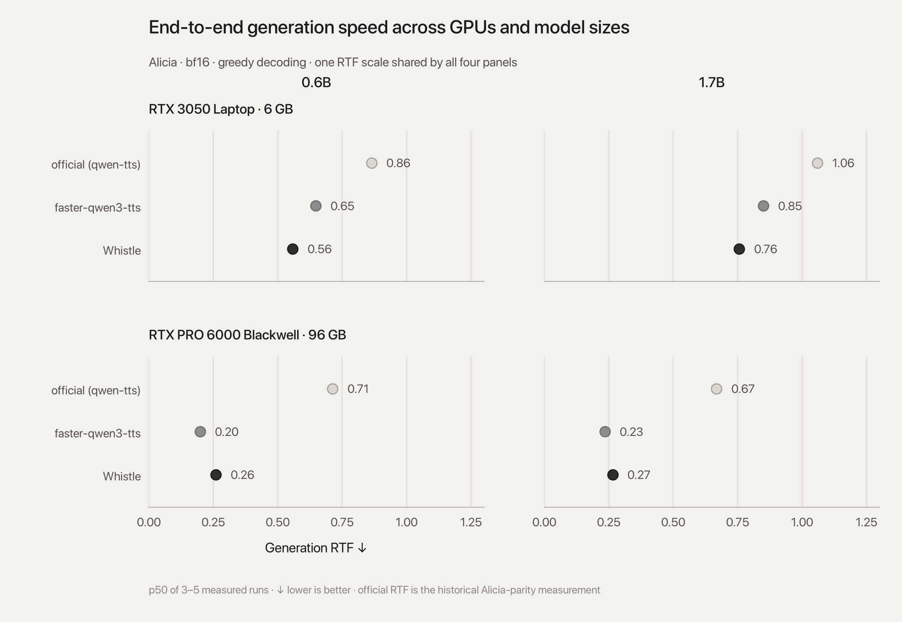
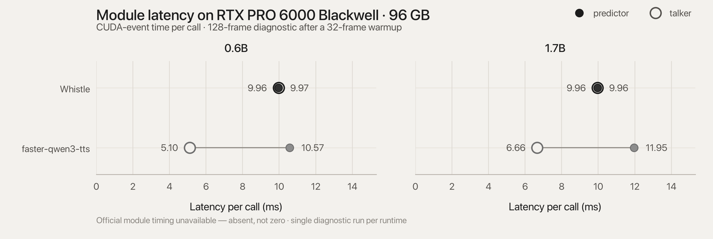
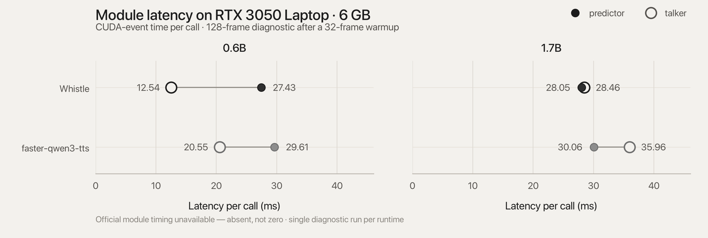

# Whistle latency report

Timing tables with their charts, one per benchmark / GPU / model / setting. RTF = wall time /
audio duration; × real-time is its inverse; both are medians of per-trial ratios,
so with variable output duration the ratio of independently computed medians need
not equal median RTF. Peak memory is the maximum per-trial allocated memory
divided by 2²⁰, not reserved memory or full device usage. "Not recorded" means no
comparable raw result was located, not zero latency.

## RTX 3050 Laptop, 6 GB: 0.6B release validation (2026-09-13, mains power)

Alicia, 0.6B, bf16, greedy, natural EOS, two full warmups then five measured
passes per runtime, one backend per process; official is a pristine model in its
own process. Records: `release_whistle_0.6b_5runs.json`,
`release_official_0.6b_5runs.json`.

| Model | Runtime | Passes | Median wall (s) | Median RTF ↓ | Median × real-time ↑ | Peak allocated MiB |
|---|---|---:|---:|---:|---:|---:|
| 0.6B | Official | 5 | 83.260 | 0.856 | 1.168 | 2,837 |
| 0.6B | Whistle | 5 | 54.268 | 0.558 | 1.793 | 3,037 |

## RTX 3050 Laptop, 6 GB: core comparison

Alicia batch generation; historical measurements. Records:
`official_current_p50_5runs.json`, `v7_current_p50_5runs.json`,
`official_1.7b_3runs.json`, `v7_1.7b_3runs.json`,
`victoria_faster_0.6b_3runs.json`, `victoria_faster_1.7b_3runs.json`.

| Model | Runtime | Measured passes | Median wall (s) | Median RTF ↓ | Median × real-time ↑ | Peak allocated MiB |
|---|---|---:|---:|---:|---:|---:|
| 0.6B | Official | 5 | 84.052 | 0.864 | 1.157 | 2,837 |
| 0.6B | Whistle | 5 | 54.310 | 0.558 | 1.791 | 3,037 |
| 0.6B | faster-qwen3-tts v0.4.0 (Victoria) | 3 | 66.268 | 0.647 | 1.545 | Not recorded |
| 1.7B | Official | 3 | 108.415 | 1.060 | 0.944 | 4,763 |
| 1.7B | Whistle | 3 | 77.448 | 0.756 | 1.322 | 4,964 |
| 1.7B | faster-qwen3-tts v0.4.0 (Victoria) | 3 | 86.966 | 0.849 | 1.177 | Not recorded |

## RTX PRO 6000 Blackwell Server Edition (Modal): core comparison

Alicia, Ryan, English, bf16, batch one; each row ran without another model
process sharing its GPU; requested 1,280-token/frame cap (whose meaning differs
between entrypoints); loading and warmups excluded. Raw Modal directories were
archived during pre-release cleanup, so these numbers are cited from this table
only.

| Model | Runtime | Measured passes | Median wall (s) | Median RTF ↓ | Median × real-time ↑ | Peak allocated MiB |
|---|---|---:|---:|---:|---:|---:|
| 0.6B | Official | 5 | 69.517 | 0.713 | 1.403 | 2,860 |
| 0.6B | Whistle, overlap off | 5 | 25.386 | 0.260 | 3.841 | 3,133 |
| 0.6B | faster-qwen3-tts v0.4.0, alone | 5 | 20.412 | 0.199 | 5.016 | Not recorded |
| 1.7B | Official | 5 | 68.327 | 0.668 | 1.498 | 4,792 |
| 1.7B | Whistle, overlap off | 5 | 27.139 | 0.265 | 3.773 | 5,065 |
| 1.7B | faster-qwen3-tts v0.4.0, alone | 3 | 24.072 | 0.235 | 4.254 | Not recorded |

## Chart: end-to-end RTF across GPUs and model sizes

*The RTF column of the two core comparison tables above, plotted: rows are
runtimes, panels are GPU × model size, one shared scale so panel widths compare.
`tools/make_figures.py` draws it from the same records, never from the tables.*

### Modular check: RTX PRO 6000

Fixed 128-frame CUDA-event diagnostic after a 32-frame warmup. One predictor call
is the complete 15-residual-codebook predictor sequence for one frame; one talker
call is the next-frame talker decode step including its attention and the
captured or eager post-attention path.

| Model | Runtime | Predictor calls | Predictor total | Predictor / call | Talker calls | Talker total | Talker / call |
|---|---|---:|---:|---:|---:|---:|---:|
| 0.6B | Whistle | 128 | 1,275.3 ms | 9.96 ms | 127 | 1,266.1 ms | 9.97 ms |
| 0.6B | faster-qwen3-tts | 128 | 1,353.1 ms | 10.57 ms | 128 | 653.4 ms | 5.10 ms |
| 1.7B | Whistle | 128 | 1,274.9 ms | 9.96 ms | 127 | 1,264.6 ms | 9.96 ms |
| 1.7B | faster-qwen3-tts | 128 | 1,530.1 ms | 11.95 ms | 128 | 852.5 ms | 6.66 ms |

*The table above as one dumbbell per runtime: filled dot = predictor, hollow ring
= talker, both CUDA-event ms per call. faster-qwen3-tts has the shorter talker
step here, Whistle the shorter predictor sequence; official module timing is
absent from the evidence, not zero.*

## Modular check: RTX 3050

Same fixed 128-frame CUDA-event diagnostic after a 32-frame warmup. Whistle's
talker wrapper uses eager dynamic-cache attention with graph-captured FFN
regions; faster-qwen3-tts uses one static-cache CUDA graph for the complete
talker step. Predictor calls contain all 15 residual codebook positions in both
implementations.

| Model | Runtime | Predictor calls | Predictor total | Predictor / call | Talker calls | Talker total | Talker / call |
|---|---|---:|---:|---:|---:|---:|---:|
| 0.6B | Whistle | 128 | 3,511.3 ms | 27.43 ms | 127 | 1,592.3 ms | 12.54 ms |
| 0.6B | faster-qwen3-tts | 128 | 3,789.5 ms | 29.61 ms | 128 | 2,630.8 ms | 20.55 ms |
| 1.7B | Whistle | 128 | 3,589.9 ms | 28.05 ms | 127 | 3,613.9 ms | 28.46 ms |
| 1.7B | faster-qwen3-tts | 128 | 3,847.0 ms | 30.06 ms | 128 | 4,603.0 ms | 35.96 ms |

*The table above, same encoding. Whistle is the shorter span in both the predictor
and the talker on this GPU, the opposite of the RTX PRO 6000 result.*

### Streaming, RTX 3050, TTFA(time-to-first-audio)

Alicia and another short sentence sample, 0.6B, bf16, chunk ramp at frames **2, 4, 8 then every
12 frames**, 25-frame codec left context, leading-silence trim on.

| Text | Frames | First CPU-ready audio (median) | Trials (ms) | Total stream (median) | Audio | Peak MiB |
|---|---:|---:|---|---:|---:|---:|
| Short (74 chars) | 77 | **116.0 ms** | 113.1 / 116.4 / 116.0 | 3.65 s | 6.16 s | 2,188 |
| Alicia (1,264 chars) | 1,216 | **154.1 ms** | 168.6 / 153.9 / 154.1 | 58.68 s | 97.28 s | 2,346 |